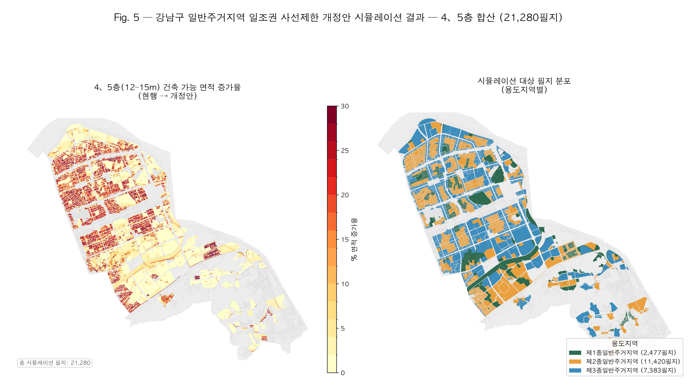
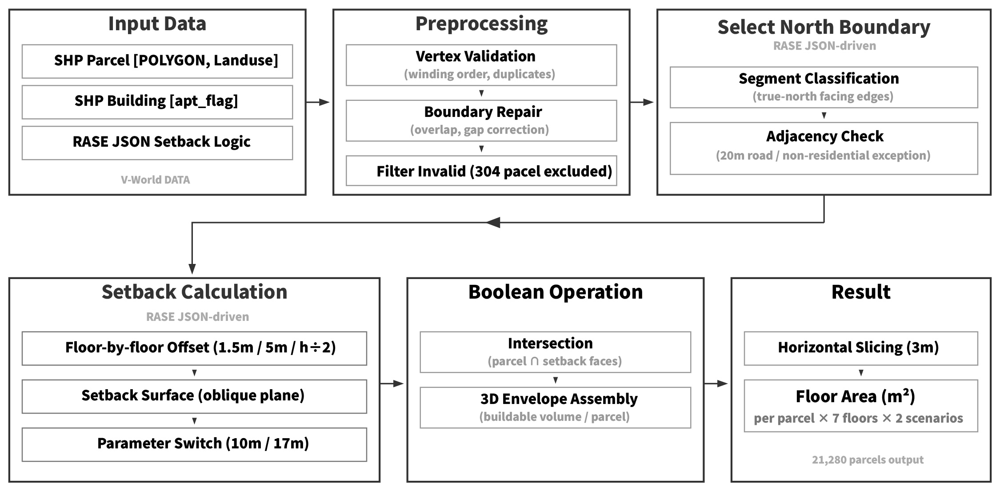
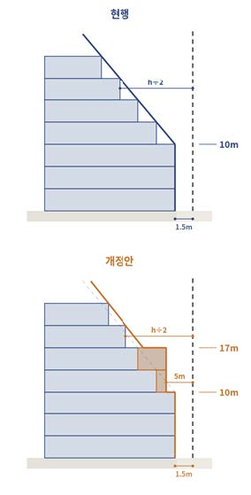
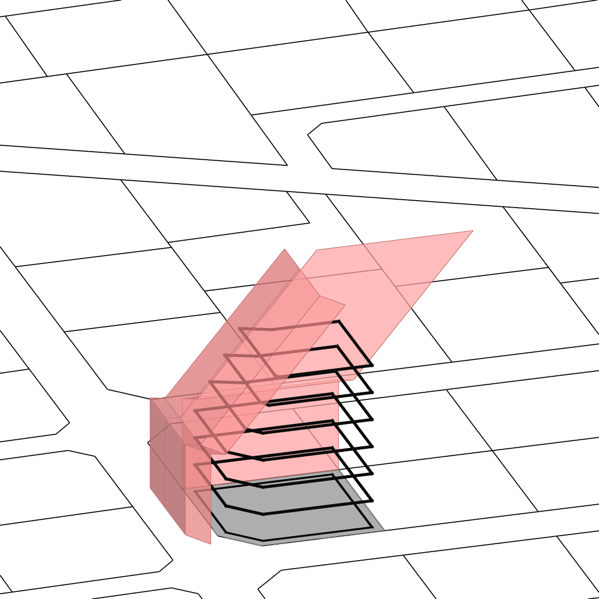
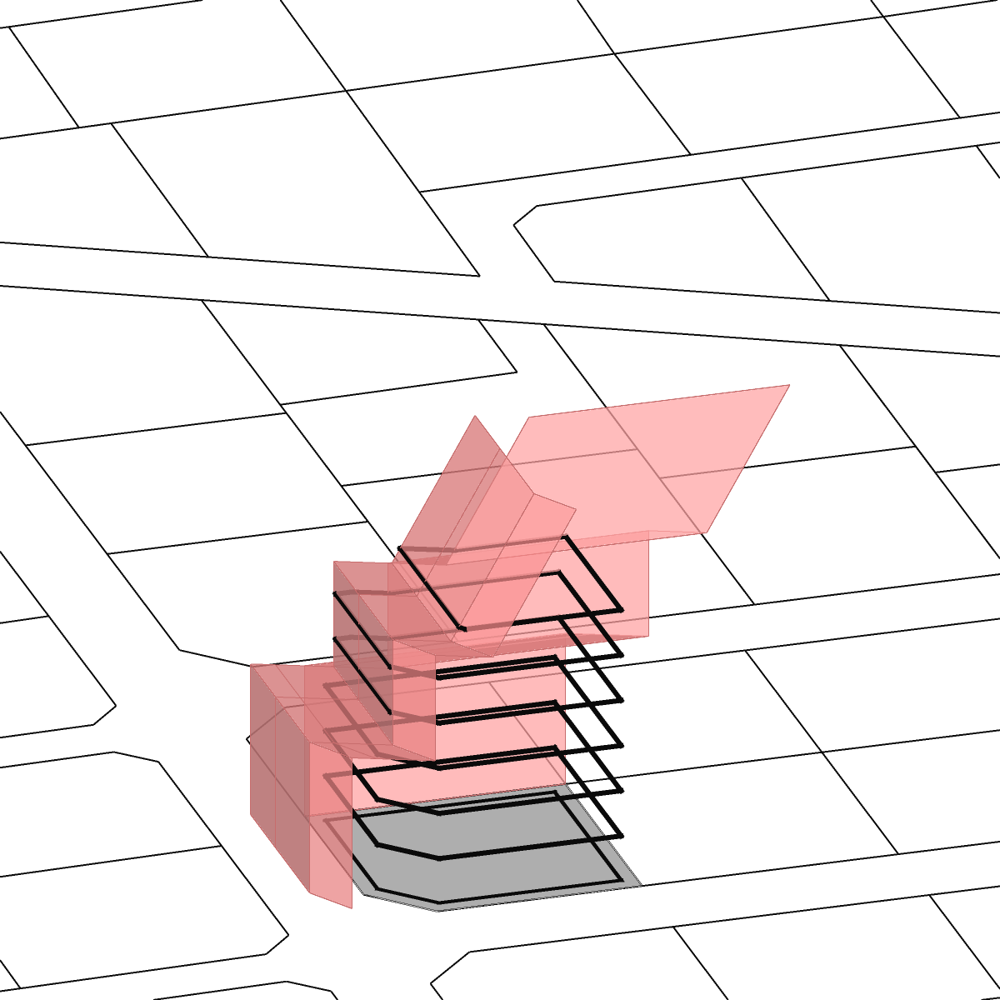
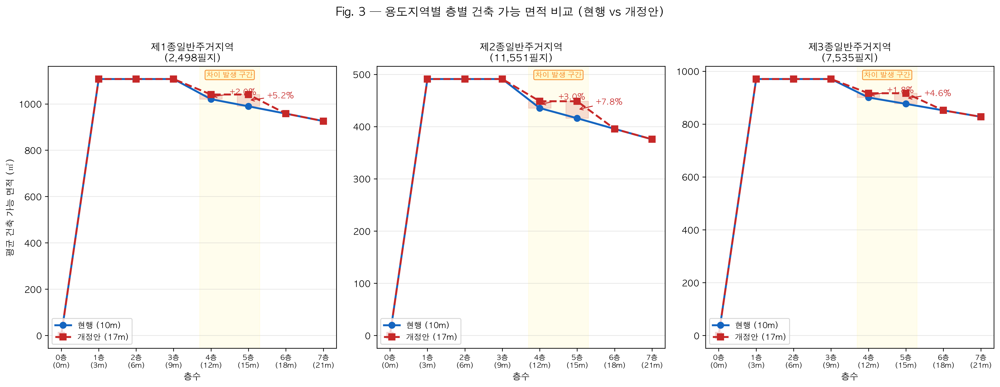
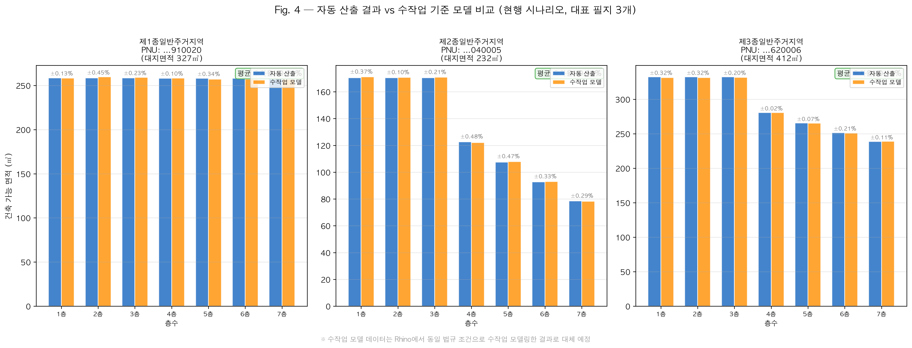

# LLM-Based Design Automation for Defining Buildable Envelopes: Simulating Daylight Setback Regulation Changes

> Implementation of an automated framework — combining LLM-based regulation extraction, RASE-format structuring, and geometry-based north-facing setback simulation across Seoul residential parcels.

> 🌐 **Interactive 3D Map (companion project)** — Seoul-wide buildable volume results (all 25 districts) rendered as 3D extruded slabs in the browser: **[3D MAP LINK ->](https://969flash.github.io/BuildableRegionGenrator/)**



Fig. 5 — Gangnam-gu general residential zone: floor 5 (15 m) buildable area change under current vs proposed setback rules (21,280 parcels)

---

## Overview

This project implements a complete pipeline for computationally assessing building envelope constraints in Seoul's residential zones, spanning three integrated stages:



Fig. 1 — Stage 3 computation pipeline: Input → Preprocessing → North Boundary Selection → Setback Calculation → Boolean Operation → Floor Area Output

**Stage 1 — Law RAG** (`law_rag/`): Retrieval-Augmented Generation over Korean building regulations (건축법 시행령, 서울특별시 건축조례). Queries are answered with grounded evidence; retrieval modes (TF-IDF, BM25, Dense, Hybrid) are benchmarked on a 50-query evaluation set.

**Stage 2 — RASE Structuring** (`law_rag/`): Retrieved regulation text is passed to an LLM (Gemini) which structures each rule into a machine-readable RASE JSON (Rule, Applicability, Scenario, Exception). This structured representation bridges human-readable law and executable code.

**Stage 3 — Setback Simulation** (`setback_sim/`): The structured rules are implemented as a geometry engine in Rhino/Grasshopper. For each residential parcel, the engine computes floor-by-floor buildable areas under both the current (Type 1) and proposed (Type 2) north-facing sky angle setback regulations, exporting both per-floor area CSV and 2D buildable polygon shapefiles.

---

## Project Structure

```text
root/
├── law_rag/                     # Stages 1 & 2 — LLM + RAG + RASE structuring
│   ├── src/
│   │   ├── main.py              # RAG Q&A engine (index / ask commands)
│   │   ├── main_gemini.py       # Gemini-based Q&A variant
│   │   ├── run_rase.py          # Stage 2: generate RASE JSON via Gemini
│   │   ├── run_rase_gem.py      # Gemini variant for RASE
│   │   ├── run_gemini_batch.py  # Batch Q&A runner (Gemini)
│   │   ├── run_selection_eval.py # Retrieval mode selection & evaluation
│   │   └── evaluate_readiness.py # Recall/Precision/MRR/Readiness metrics
│   ├── data/                    # Building regulation documents (.md)
│   │   ├── 건축법 시행령/
│   │   └── 서울특별시 건축 조례/
│   ├── config/
│   │   └── eval_queries.json    # 50-query evaluation set with gold labels
│   ├── outputs/
│   │   ├── rase_outputs/        # RASE-structured regulation JSONs (Ollama variant)
│   │   └── rase_outputs_gem/    # RASE-structured regulation JSONs (Gemini variant)
│   ├── docs/                    # Project & paper notes (PROJECT_INTRO, THESIS_SECTION_3_2)
│   └── requirements.txt
│
├── setback_sim/                 # Stage 3 — Setback geometry simulation
│   ├── northsky.py              # Core calculator (NorthSkyCalculator)
│   ├── shp_northsky_batch.py    # Single-SHP batch (legacy, area CSV only)
│   ├── seoul_geom_export.py     # Seoul-wide batch: polygons + CSV + resume
│   ├── gh_seoul_export_component.py  # Paste-into-GhPython driver (defensive)
│   ├── shp_to_lot.py            # SHP loader and residential lot filter
│   ├── utils.py                 # Geometry utilities (Rhino + Shapely)
│   └── constants.py             # Policy constants (setback rules, tolerances)
│
├── scripts/                     # Data prep + verification
│   ├── add_apt_yn.py            # Join 용도별건물정보 (AL_D198) → APT_YN/BUILD_CNT
│   └── verify_geom_shp.py       # Schema / CRS / BBOX / dedup ratio audit
│
├── data/                        # Shared GIS / cadastral data
│   ├── Parcels.shp              # Sample (235 lots, Gangnam subset for smoke tests)
│   ├── Gangnam.shp              # Full Gangnam (34K shapes, joined APT_YN)
│   └── 국가중점데이터_컬럼정의서*.xlsx  # Column dictionary for AL_D194 / D198
│
└── docs/                        # Research artifacts
    ├── 0331_원고.pdf            # Manuscript
    ├── northsky_pseudocode.md   # Setback algorithm pseudocode
    ├── project_io_and_logic_ko.md
    ├── figures/                 # Paper figures (Fig. 1–6)
    └── scenario_analysis/       # RASE scenario validation (cross_check, scenario_report, rase_json/)
```

---

## Stage 1 — Law RAG: Regulation Retrieval

The `law_rag/` module indexes Korean building regulation documents in Markdown and answers structured queries using a RAG pipeline.


Fig. — Structured query set (Q0–Q3) covering north-facing setback, setback distance, and height regulations

### Retrieval Modes

| Mode | Method |
| --- | --- |
| `tfidf` | Sparse TF-IDF cosine similarity |
| `bm25` | Probabilistic keyword scoring |
| `dense` | Truncated SVD dense embeddings |
| `hybrid_tfidf_bm25` | α·TF-IDF + (1-α)·BM25 |
| `hybrid_bm25_dense` | α·BM25 + (1-α)·Dense |
| `hybrid_tfidf_dense` | α·TF-IDF + (1-α)·Dense |

Regulation-specific keyword signals (e.g., 제86조, 일조, 정북, 인접대지경계선) trigger score boosting for relevant chunks. Chunking uses **structural splitting by article** (`제○조` regex boundaries), so each article maps to exactly one chunk. Deleted articles, addenda, and TOC stubs are filtered out automatically. (A legacy 900-char sliding-window mode is retained for ablation comparison but is not used in the final pipeline.)

### Evaluation Results (50-query set, top-5 retrieval)

| Mode | Recall@5 | Precision@5 | Readiness Acc. | MRR |
| --- | --- | --- | --- | --- |
| TF-IDF | **0.872** | **0.636** | **0.880** | **0.743** |
| BM25 | 0.752 | 0.524 | 0.760 | 0.674 |
| Dense | 0.702 | 0.444 | 0.700 | 0.617 |
| Hybrid TF-IDF+BM25 | 0.788 | 0.528 | 0.780 | 0.693 |
| Hybrid BM25+Dense | 0.798 | 0.532 | 0.780 | 0.695 |
| Hybrid TF-IDF+Dense | 0.768 | 0.480 | 0.760 | 0.643 |

Model selection applies a **gate + priority rule**: only models with Readiness Accuracy ≥ 0.85 qualify; among those, ranked by Recall@5 > Precision@5 > MRR. **TF-IDF single retrieval** is the selected model.

### Setup

```bash
cd law_rag
python -m venv .venv && source .venv/bin/activate
pip install -r requirements.txt
```

Requires Ollama server running locally (`ollama serve`) for the Ollama-based LLM backend.

### Usage

```bash
# Index regulation documents
python src/main.py index

# Ask a question
python src/main.py ask "정북방향 일조권 사선제한 기준은?" --retrieval-mode tfidf --top-k 5

# Run full evaluation and retrieval mode selection
python src/run_selection_eval.py
```

---

## Stage 2 — RASE Structuring

Outputs from Stage 1 Q&A logs are passed to an LLM (Gemini) which restructures each retrieved regulation into a **RASE JSON**:

```json
{
  "article_id": "제86조",
  "article_title": "일조 등의 확보를 위한 건축물의 높이 제한",
  "R": { "description": "정북방향 인접 대지경계선으로부터 이격 의무" },
  "A": { "applicable_zones": ["전용주거지역", "일반주거지역"] },
  "S": {
    "conditions": [
      { "height_range": "높이 10m 이하", "rule": "1.5m 이상 이격" },
      { "height_range": "높이 10m 초과", "rule": "높이 × 0.5 이상 이격" }
    ]
  },
  "E": { "exceptions": ["도로 접면 20m 이상 등 예외 조건"] }
}
```

```bash
# Generate RASE JSONs from QA logs (Gemini API)
python src/run_rase.py
```

Requires `GEMINI_API_KEY` set in `.env`.

---

## Stage 3 — Setback Simulation

The `setback_sim/` module implements the RASE-specified rules as a geometry engine that computes floor-by-floor buildable areas per parcel.

### Setback Rules



Fig. 6 — Setback geometry concept (north-facing cross-section): Current (Type 1, top) vs Proposed (Type 2, bottom)

| Rule | Height range | Setback distance |
| --- | --- | --- |
| Type 1 (Current) | ≤ 10 m | Fixed 1.5 m |
| Type 1 (Current) | > 10 m | height × 0.5 |
| Type 2 (Proposed) | ≤ 10 m | Fixed 1.5 m |
| Type 2 (Proposed) | 10 m – 17 m | Fixed 5.0 m |
| Type 2 (Proposed) | > 17 m | height × 0.5 |

A 1 m inward offset from the parcel boundary is applied as baseline correction before setback computation.

### Computation Pipeline

```text
Parcels.shp
    │
    ▼
shp_to_lot.py  ── filter: General Residential Zone (A13: 13/14/15)
    │
    ▼
northsky.py  ── NorthSkyCalculator
    ├── detect north-facing base segments
    ├── apply 20 m road exclusion rule
    ├── apply apartment centerline correction
    └── generate setback cutters per floor height
    │
    ▼
shp_northsky_batch.py  ── floors 1–7 × Types 1 & 2
    │
    ▼
data/result/  →  CSV     data/qa/  →  QA logs
```

<table><tr>
<td><br>Fig. 2a — Type 1 (Current): setback grows proportionally above 10 m</td>
<td><br>Fig. 2b — Type 2 (Proposed): fixed 5 m zone between 10–17 m expands mid-rise floors</td>
</tr></table>

### Requirements

Requires **Rhino 7+** with Grasshopper and RhinoCommon (bundled). Python libraries (`shapely`, `geopandas`, `pyshp`) must be installed in Rhino's Python environment.

### Running the Simulation

#### Single-parcel (Grasshopper)

1. Open `setback_sim/main.gh` in Rhino/Grasshopper
2. Connect `target_lot` and `other_lots` inputs
3. Set `height` (m), `setback_type` (1 or 2)
4. Outputs: `northsky_base_segments`, `northsky_buildable_boundary`, `northsky_cutter_breps`

#### Batch (all parcels)

```python
# In Grasshopper Python component:
shp_dir = r"C:\path\to\data\"
target_lot_limit = None   # or integer for testing
```

Run `setback_sim/shp_northsky_batch.py`. Results saved to `data/result/` with timestamp.

#### Seoul-wide batch (multi-district, polygon output)

For city-scale runs producing **per-floor 2D polygon shapefiles**, use `seoul_geom_export.py` through a fresh GH Python component. The driver script `gh_seoul_export_component.py` provides defensive imports, diagnostic logging, and per-district `.done` markers so the run is resumable.

Key features over the legacy batch:
- Single calculator init per parcel reused across both setback types (~2× speedup)
- Floor-range deduplication: consecutive identical floor shapes merge into a single record (`floor_from`/`floor_to`), ~30–50% feature reduction
- Streaming SHP writers per type, real-time log file with `flush()` for `tail -f` monitoring
- `.done` markers per district enable mid-run resume without redoing completed districts

GH inputs: `folder_path` (str, directory of district SHPs), `run` (bool). Output: `{folder}/result_geom/{district}_buildable_type{N}_*.shp` plus a single `.done` flag per district.

### Data preparation: APT_YN field

The setback engine consults the lot attribute `APT_YN` to detect when a neighboring lot across a road is a general-residential apartment, triggering a centerline correction. The standard 토지특성정보 (AL_D194) SHP does not include this column. `scripts/add_apt_yn.py` joins 용도별건물정보 (AL_D198) on PNU, aggregates per parcel, and emits `APT_YN`, `BUILD_CNT`, `BUILD_USE_` columns. APT_YN = "Y" when any building on the parcel has 주요용도코드 `02000` (공동주택). Verified against the legacy Gangnam reference at 98.65% PNU-level agreement.

### Verifying outputs

```bash
python3 scripts/verify_geom_shp.py data/_seoul_apt/result_geom/
```

Checks field schema (`pnu`, `floor_from`, `floor_to`, `type`, `h_base_m`, `h_top_m`, `zone_cd`, `area_m2`, `seg_cnt`), CRS (EPSG:5179), Seoul BBOX, polygon closure, and feature counts.

---

## Results

### Floor-by-Floor Area Comparison



Fig. 3 — Average floor-by-floor buildable area by residential zone (Current vs Proposed): 1st-class (2,498), 2nd-class (11,551), 3rd-class (7,535 parcels)

The proposed Type 2 rule consistently expands buildable area in the 4F–6F range (12–18 m) across all three zone classes, most prominently in the 2nd-class zone.

### Validation



Fig. 4 — Automated output vs hand-calculated reference (Current scenario, 3 representative parcels)

---

## Output Schema

### data/result/ — Floor-by-floor buildable area CSV

| Column | Description |
| --- | --- |
| `pnu` | Parcel identifier |
| `jimok` | Land category |
| `landuse_code` / `landuse` | Zone code and name |
| `lot_area_m2` | Original parcel area |
| `lot_area_inward_1m_m2` | Area after 1 m inward offset |
| `floor` | Floor number (1–7) |
| `height_m` | Height (3, 6, … 21 m) |
| `allowed_area_m2` | Buildable floor area at this height |
| `base_segment_count` | Active setback base segments |

### data/qa/ — QA Logs

| File | Contents |
| --- | --- |
| `*_warning_pnu_*.csv` | Parcels with geometry warnings |
| `*_road20m_exclusion_*.csv` | Segments excluded by 20 m road rule |
| `*_apartment_centerline_*.csv` | Apartment centerline corrections |

### result_geom/ — Per-floor buildable polygons

Produced by `setback_sim/seoul_geom_export.py`. EPSG:5179 Polygon shapefile per (district, setback_type).

| Column | Type | Description |
| --- | --- | --- |
| `pnu` | C(20) | Parcel identifier |
| `floor_from` | N(2) | First floor covered by this polygon (1–7) |
| `floor_to` | N(2) | Last floor covered by this polygon (1–7) |
| `type` | N(1) | Setback scenario (1 = current, 2 = proposed) |
| `h_base_m` | N(6.2) | (floor_from − 1) × 3 |
| `h_top_m` | N(6.2) | floor_to × 3 |
| `zone_cd` | C(3) | 13/14/15/17 (general residential code) |
| `area_m2` | N(12.4) | Polygon area |
| `seg_cnt` | N(3) | Active setback base segments |

Consecutive floors sharing geometry are merged into one record via `floor_from`/`floor_to` range encoding.

---

## Data Sources

| Dataset | ID | Provider | Use |
| --- | --- | --- | --- |
| **토지특성정보 (Land Characteristic Information)** | AL_D194 | 국토교통부 (MOLIT) via [data.go.kr](https://www.data.go.kr/) | Cadastral parcel polygons with PNU, 지목, 용도지역 |
| **용도별건물정보 (Building Use Information)** | AL_D198 | 국토교통부 (MOLIT) via [data.go.kr](https://www.data.go.kr/) | Per-building 주요용도코드 → derives APT_YN |
| **건축법 시행령** | — | 법제처 (Korea Ministry of Government Legislation) | Stage 1 regulation corpus |
| **서울특별시 건축조례** | — | 서울특별시 | Stage 1 local ordinance corpus |

The 국가중점데이터 (National Key Open Data) cadastral datasets are released per 시군구 as zipped SHPs (.shp/.shx/.dbf/.prj). The column dictionary is included in `data/국가중점데이터_컬럼정의서*.xlsx` for reference. All sources are open data, free for research and redistribution with attribution.

---

## License

Code is released under the MIT License (see `LICENSE`). Output simulation data derived from the cadastral inputs above is released under the same terms as the source datasets (Korea Open Government License Type 1: free use with attribution).

---

## Citation

```bibtex
@article{byun2026llm,
  title   = {LLM-Based Design Automation for Defining Buildable Envelopes:
             Simulating Daylight Setback Regulation Changes},
  author  = {Byun, Sanghoon and Oh, Jungseuk and Kang, Bumjoon},
  journal = {Journal of the Urban Design Institute of Korea (한국도시설계학회지)},
  year    = {2026},
  note    = {Forthcoming}
}
```

---

## Authors

| Name | Affiliation | Role |
| --- | --- | --- |
| Sanghoon Byun | LAUS, Seoul National University | Author |
| Jungseuk Oh | LAUS, Seoul National University | Author |
| Bumjoon Kang | LAUS, Seoul National University | Advisor |

---

## Acknowledgments

This research was conducted at the **[LAUS (Lab. for Architectural & Urban Space)](https://laus.snu.ac.kr/)**, Department of Architecture and Architectural Engineering, **Seoul National University**, under the supervision of Prof. Bumjoon Kang.
